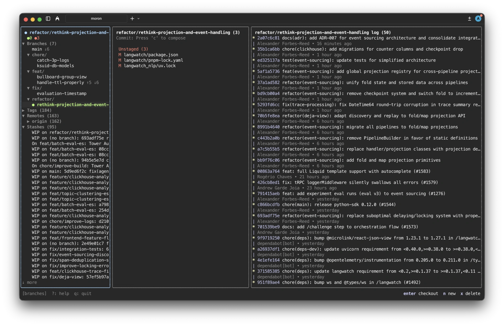

# moron

Vibe coded git client. You'd be a moron for using this.



## Install

```sh
go install github.com/0xdeafcafe/moron@latest
```

Then just run `moron` in any git repo, or `moron <dir>` to open another
repository without cd-ing there.

## Inspect, don't checkout

Selecting things in the branches panel never mutates your working copy:

- **Enter on a branch** shows a read-only diff of that branch against HEAD
  (three-dot merge-base diff) — no checkout.
- **Enter on a worktree** re-targets the whole UI at that worktree, so you
  can browse its status, diffs, and log without touching the filesystem.
  The worktree you came from stays in the list, so you can jump back.
- **c on a branch** checks it out, after a confirmation dialog (with the
  stash-and-switch flow if the tree is dirty). `ctrl+p` still opens the
  switch-branch palette.

## Embedding

The TUI is importable — `tui.Run(dir)` opens the app for the repository
containing `dir` and blocks until the user quits:

```go
import "github.com/0xdeafcafe/moron/tui"

if err := tui.Run("."); err != nil { ... }
```
